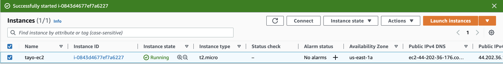
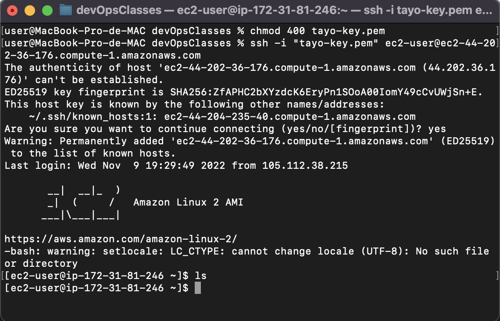
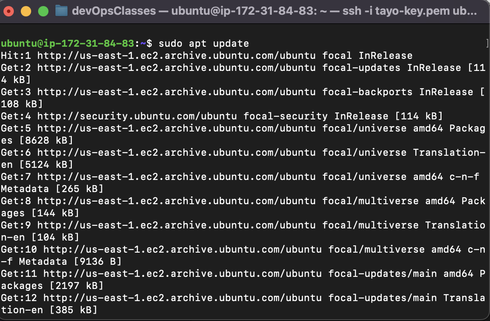
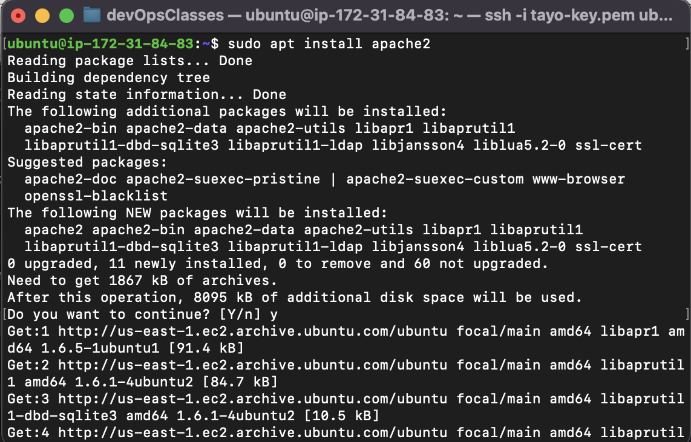
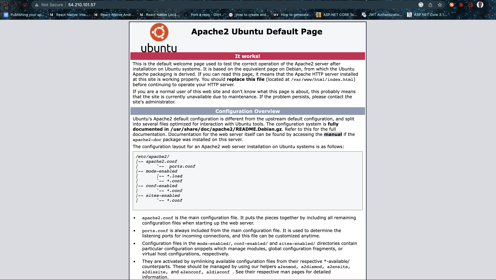
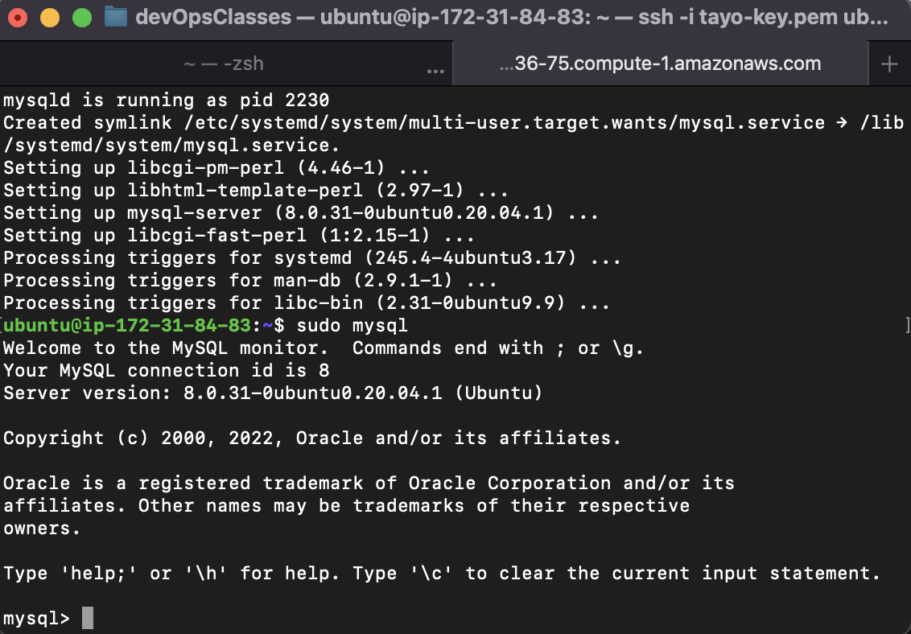
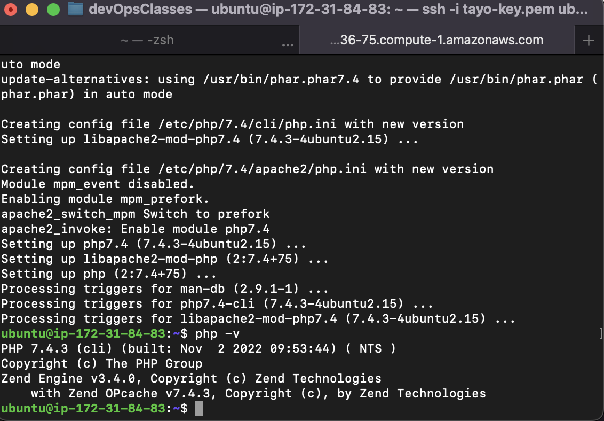
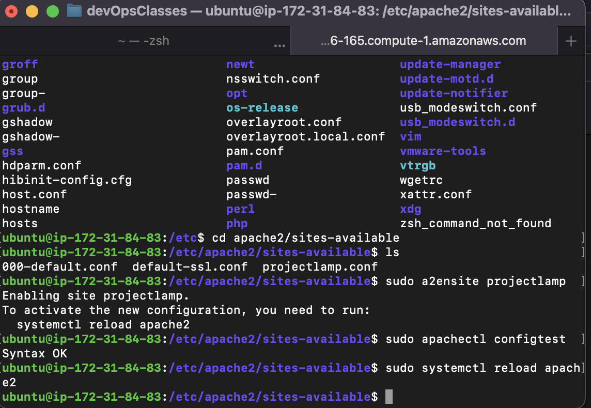
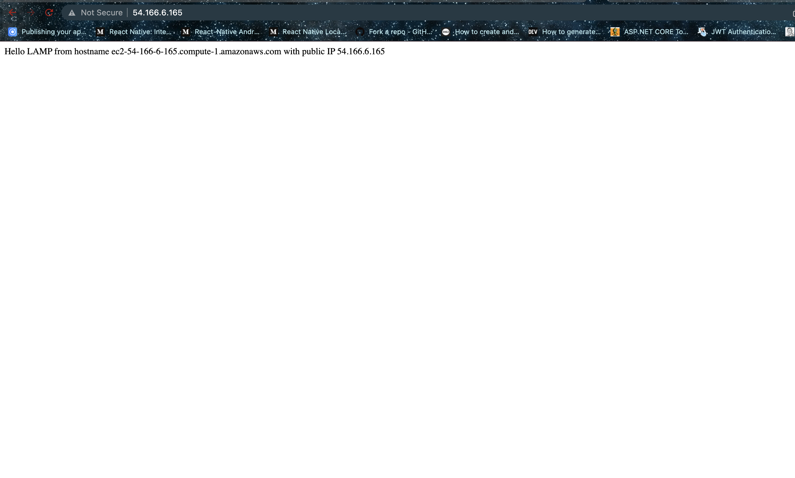
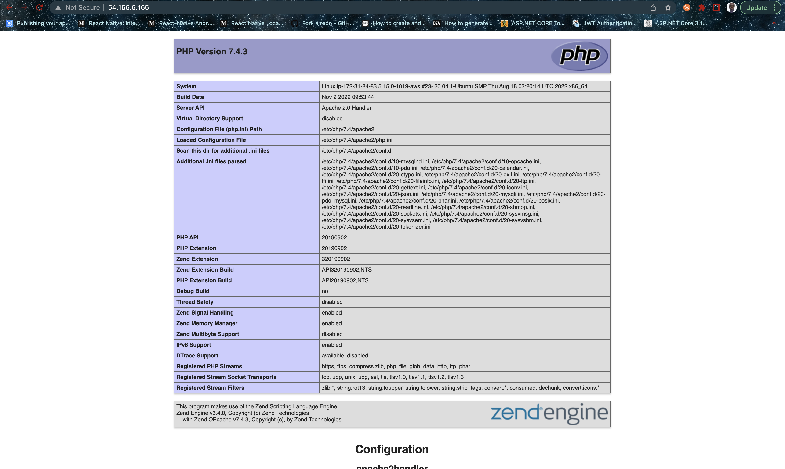

# Step 0

1. Spinned Up a EC2 Instance

1. Connected to EC2 via SSH 

# Step 1
1. Update Package

1. Install Apache2

1. Added http to security Group, now the Apache Webserver request on port 80

# Step 2
1. Install Mysql Server and Connected the to it

# Step 3
1. Install Php pho-mysql and libapacha2-mod-php

# Step 4
1. Setting Up Virtual host

# Step 5
1. Enable PHP on the website

