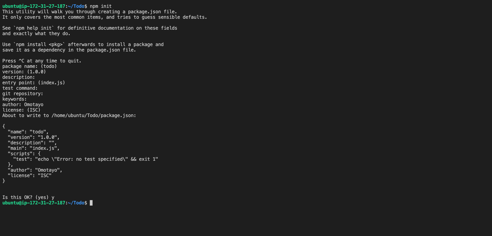

# Step 1
SetUp a backend Configuarion

# Step 2
SetUp ExpressJs on the backend
1. npm install express

1. Install dotenv package to manage .env variables (npm install dotenv )

# Step 3
Models 
1. installed ORM for MongoDB
1. Connect to remote (mLab) database successfully

# Step 4
Setup frontend
1. Install react app

