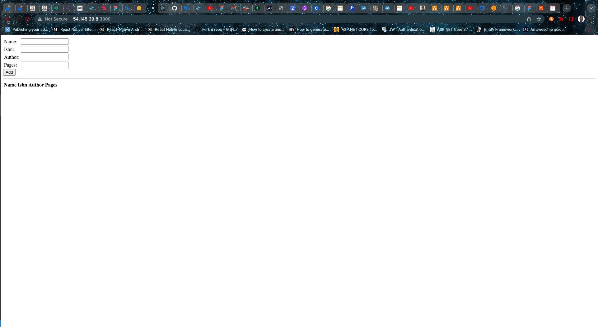

# Step 1
- Add Certificates

```
sudo apt -y install curl dirmngr apt-transport-https lsb-release ca-certificates
```


- Install Nodes

```
sudo apt install -y nodejs
```
# Step 2

- Install MongoDB

```
sudo apt-key adv --keyserver hkp://keyserver.ubuntu.com:80 --recv 0C49F3730359A14518585931BC711F9BA15703C6

echo "deb [ arch=amd64 ] https://repo.mongodb.org/apt/ubuntu trusty/mongodb-org/3.4 multiverse" | sudo tee /etc/apt/sources.list.d/mongodb-org-3.4.list

sudo apt install -y mongodb
```


- Start MongoDB Server

```
sudo service mongodb start

```


- Install NPM package

```
sudo apt install -y npm

```

- Install Body Parser
```
sudo npm install body-parser
```

# Step 3

- Install Express and Mongoose

```
sudo npm install express mongoose
```

- Can access app from the public IP


